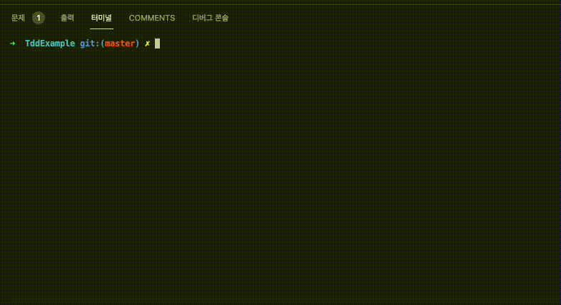

# TDD Restaurants
본인이 좋아하는 식당을 메모할 수 있는 **React Native** 기반의 **Application**입니다!
## 만들게 된 이유
- 평소에 ```Unit Test```와 ```TDD``` 방법론에 대해 궁금한 점이 많았기 때문에
- 프로그램 하나 만들기도 벅찬데 왜 테스트 코드까지 작성해야 하는지에 대한 의문이 풀리질 않아서
## 핵심 패키지
- React
- React Native
- Jest
- react-test-renderer
- @testing-library/jest-native
- @testing-library/react-native
- @types/jest
## 시연


## TDD
보통의 개발 방식은 **기획서**와 **디자인**을 전달받아서 UI를 그리고, 기능을 연동하여 개발을 완료합니다. 즉각적인 수정과 배포가 가능한 웹과 앱에서는 특히 **이슈가 발생한다**에 대한 두려움이 덜한것이 사실입니다. 이슈에 대한 두려움보다 고객사의 재촉으로 인해 마감부터 빨리 넘기고 뒷수습을 하는게 대부분이죠.

TDD 개발론은 이렇게 그냥 넘어가는 이슈와, 무책임한 개발로 생겨난 기술적인 빚을 감당 못하는 사태가 많아지자 생겨난 방식입니다. **실제로 기능을 하는 컴포넌트를 먼저 만드는게 아닌, 해당 페이지가 어떤식으로 구현 될 지를 먼저 예상하고 테스트 코드를 작성하는 형태**입니다.

그러다보니 커밋도 아래와 같은 형태를 취합니다.
```
test: Home 테스트 코드 작성
feat: Home 구현
...
```
위와 같이 작업을 해보니, 테스트 라이브러리의 특성상 무심코 지나칠 수 있는 ```Warning```이나 심각성이 낮은 ```Error```에도 ```Coverage```를 용서없이 깎아버리기 때문에 즉각적으로 대응을 해야만 하는 느낌이 들게 되어 보다 완성도있는 소프트웨어를 만들 수 있을 것 같았고, 테스트를 먼저 작성하고나니까 ```UI``` 구현에 있어서 막힘이 없이 진행되는 듯한 효과를 보았습니다.
## 후기
제가 ```Unit Test```의 필요성에 대해 의문을 가진 것은 기술 블로그에서 보여주는 예시들이 대부분 ```expect(1 + 1).toBe(2)``` 이런 식이기 때문에 **"뭐야 그러면 프로그램이 굴러가는 로직에 대해서도 코딩해야 하고, 결과물도 만들어야 하는거야? 왜 그런 짓을 해?"** 라는 생각이 들었습니다.

그러나 실제로 ```Jest```와 ```Jest Renderer```를 이용하여 ```Unit Test```를 진행해보니까 **기획서에 적힌 고리타분한 유저스토리를 실제 사용자가 되어 시행하는 듯한 느낌**이 들어서 재밌었고, 로직만을 구성하는게 아니라 실제로 제작한 컴포넌트들을 렌더링하여 **생명주기, 이벤트 트리거**와 같이 실제로 내가 만든 컴포넌트를 동작시키는 봇을 만드는 것 같아 흥미로웠습니다. 하나의 커밋을 완료하면 **테스트 해봤을 때 됐으니까 별 문제 없겠지~** 라는 생각으로 지나간 부분들이 추후 진행되는 추가 및 수정 개발로 인해 ```Side Effect```가 생겨서 기획팀으로부터 메신저가 불이 났던 경험이 많았는데, 각 컴포넌트 혹은 스크린마다 해당 기능을 대신 테스트 해주는 봇이 하나씩 있다고 생각하니까 괜시리 듬직하고, 커버리지만 잘 챙겨주면 수많은 ```Side Effect```를 미연에 방지할 수 있겠다는 생각이 들었습니다.
